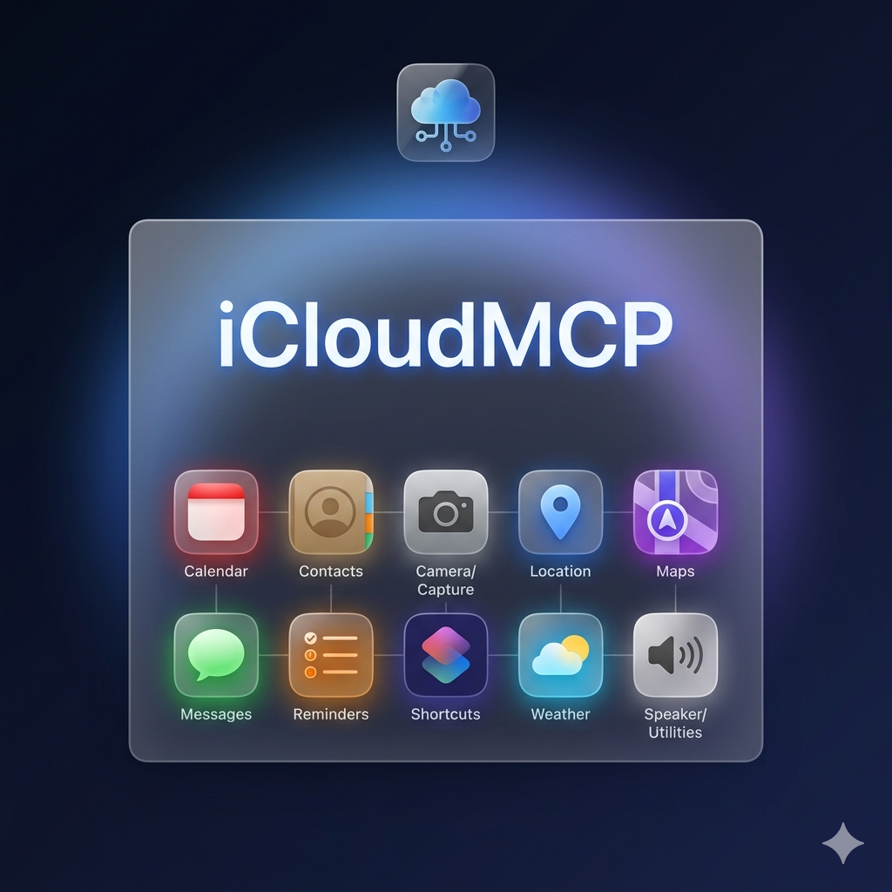

<p align="center">
  
</p>

> [!NOTE]
> **This is a fork of [iMCP](https://github.com/mattt/iMCP) by [Mattt](https://mat.tt).**
> iCloudMCP extends and rebrands the original project. All credit for the core architecture,
> MCP server design, iMessage database access, JSON-LD tooling, and the bulk of the codebase
> belongs to Mattt and the original contributors. See [Acknowledgments](#acknowledgments).

iCloudMCP is a macOS app for connecting your digital life with AI.
It works with [Claude Desktop][claude-app]
and a [growing list of clients][mcp-clients] that support the
[Model Context Protocol (MCP)][mcp].

## Capabilities

<table>
  <tr>
    <th>
      
    </th>
    <td><strong>Calendar</strong></td>
    <td>View and manage calendar events, including creating new events with customizable settings like recurrence, alarms, and availability status.</td>
  </tr>
  <tr>
    <th>
      
    </th>
    <td><strong>Contacts</strong></td>
    <td>Access contact information about yourself and search your contacts by name, phone number, or email address.</td>
  </tr>
  <tr>
    <th>
      
    </th>
    <td><strong>Location</strong></td>
    <td>Access current location data and convert between addresses and geographic coordinates.</td>
  </tr>
  <tr>
    <th>
      
    </th>
    <td><strong>Maps</strong></td>
    <td>Provides location services including place search, directions, points of interest lookup, travel time estimation, and static map image generation.</td>
  </tr>
  <tr>
    <th>
      
    </th>
    <td><strong>Messages</strong></td>
    <td>Access message history with specific participants within customizable date ranges.</td>
  </tr>
  <tr>
    <th>
      
    </th>
    <td><strong>Reminders</strong></td>
    <td>View and create reminders with customizable due dates, priorities, and alerts across different reminder lists.</td>
  </tr>
  <tr>
    <th>
      
    </th>
    <td><strong>Weather</strong></td>
    <td>Access current weather conditions including temperature, wind speed, and weather conditions for any location.</td>
  </tr>
</table>

## Getting Started

### Build from source

iCloudMCP is a development fork. To run it, build from source using Xcode:

```console
git clone https://github.com/ksyed0/iCloudMCP.git
open iCloudMCP.xcodeproj
```

Select the **iCloudMCP** scheme and build (`⌘B`). Requires macOS 15.3 or later and Xcode 16+.


When you open the app,
you'll see a

icon in your menu bar.

Clicking on this icon reveals the iCloudMCP menu,
which displays all available services.
Initially, all services will appear in gray,
indicating they're inactive.

The blue toggle switch at the top indicates that the MCP server is running
and ready to connect with MCP-compatible clients.

<br clear="all">

### Activate services

To activate a service, click on its icon.
The system will prompt you with a permission dialog.
For example, when activating Calendar access, you'll see a dialog asking `"iCloudMCP" Would Like Full Access to Your Calendar`.
Click <kbd>Allow Full Access</kbd> to continue.

> [!IMPORTANT]
> iCloudMCP **does not** collect or store any of your data.
> Clients like Claude Desktop _do_ send
> your data off device as part of tool calls.

Once activated,
each service icon goes from gray to its distinctive color —
red for Calendar, green for Messages, blue for Location, and so on.

Repeat this process for all of the capabilities you'd like to enable.
These permissions follow Apple's standard security model,
giving you complete control over what information iCloudMCP can access.

### Connect to Claude Desktop

If you don't have Claude Desktop installed,
you can [download it here](https://claude.ai/download).

Open Claude Desktop and go to "Settings... (<kbd>⌘</kbd><kbd>,</kbd>)".
Click on "Developer" in the sidebar of the Settings pane,
and then click on "Edit Config".
This will create a configuration file at
`~/Library/Application Support/Claude/claude_desktop_config.json`.

To connect iCloudMCP to Claude Desktop,
click 
\> "Configure Claude Desktop".

This will add or update the MCP server configuration to use the
`icloudmcp-server` executable bundled in the application.
Other MCP server configurations in the file will be preserved.

<details>
<summary>You can also configure Claude Desktop manually</summary>

Click 
\> "Copy server command to clipboard".
Then open `claude_desktop_config.json` in your editor
and enter the following:

```json
{
  "mcpServers": {
    "iCloudMCP": {
      "command": "{paste iCloudMCP server command}"
    }
  }
}
```

</details>

### Call iCloudMCP tools from Claude Desktop

Quit and reopen the Claude Desktop app.
You'll be prompted to approve the connection.

After approving the connection,
you should now see 🔨12 in the bottom right corner of your chat box.
Click on that to see a list of all the tools made available to Claude
by iCloudMCP.

Now you can ask Claude questions that require access to your personal data,
such as:

> "How's the weather where I am?"

Claude will use the appropriate tools to retrieve this information,
providing you with accurate, personalized responses
without requiring you to manually share this data during your conversation.

### Connect to [Claude Code][claude-code]

To add iCloudMCP globally after installing the app:

```console
claude mcp add --scope user iCloudMCP -- /Applications/iCloudMCP.app/Contents/MacOS/icloudmcp-server
```

<details>
<summary>Or import from Claude Desktop</summary>

If you've already configured Claude Desktop, you can import its MCP servers:

```console
claude mcp add-from-claude-desktop
```

</details>

### Connect to [Cursor][cursor]

Open this deep link to automatically install the iCloudMCP server:

<a href="https://cursor.com/en-US/install-mcp?name=iCloudMCP&config=eyJjb21tYW5kIjoiL0FwcGxpY2F0aW9ucy9pQ2xvdWRNQ1AuYXBwL0NvbnRlbnRzL01hY09TL2ljbG91ZG1jcC1zZXJ2ZXIifQo=">
  <picture>
    <source media="(prefers-color-scheme: dark)" srcset="https://cursor.com/deeplink/mcp-install-dark.svg">
    <source media="(prefers-color-scheme: light)" srcset="https://cursor.com/deeplink/mcp-install-light.svg">
    
  </picture>
</a>

### Connect to [Amp][amp]

To add iCloudMCP globally (available in all projects):

```console
amp mcp add iCloudMCP -- /Applications/iCloudMCP.app/Contents/MacOS/icloudmcp-server
```

> [!NOTE]
> When a client first connects, iCloudMCP will show an approval dialog.
> Click "Allow" and check "Always trust this client" to avoid repeated prompts.

## Technical Details

### App & CLI

iCloudMCP is a macOS app that bundles a command-line executable, `icloudmcp-server`.

- [`iCloudMCP.app`](/App/) provides UI for configuring services and — most importantly —
  a means of interacting with macOS system permissions,
  so that it can access Contacts, Calendar, and other information.
- [`icloudmcp-server`](/CLI/) provides an MCP server that
  uses standard input/output for communication
  ([stdio transport][mcp-transports]).

The app and CLI communicate with each other on the local network
using [Bonjour][bonjour] for automatic discovery.
Both advertise a service with type "\_mcp.\_tcp" and domain "local".
Requests from MCP clients are read by the CLI from `stdin`
and relayed to the app;
responses from the app are received by the CLI and written to `stdout`.
See [`StdioProxy`](https://github.com/ksyed0/iCloudMCP/blob/main/CLI/main.swift)
for implementation details.

The app uses the [Swift SDK][swift-sdk] for Model Context Protocol servers and clients
to handle proxied requests from MCP clients.

### iMessage Database Access

Apple doesn't provide public APIs for accessing your messages.
However, the Messages app on macOS stores data in a SQLite database located at
`~/Library/Messages/chat.db`.

iCloudMCP runs in [App Sandbox][app-sandbox],
which limits its access to user data and system resources.
When you go to enable the Messages service,
you'll be prompted to open the `chat.db` file through the standard file picker.
When you do, macOS adds that file to the app's sandbox.
[`NSOpenPanel`][nsopenpanel] is magic like that.

But opening the iMessage database is just half the battle.
Over the past few years,
Apple has moved away from storing messages in plain text
and instead toward a proprietary `typedstream` format.

The app uses [Madrid][madrid]:
a Swift package for reading your iMessage database.
It includes a Swift implementation for decoding Apple's `typedstream` format,
adapted from Christopher Sardegna's [imessage-exporter] project
and [blog post about reverse-engineering `typedstream`][typedstream-blog-post].

### JSON-LD for Tool Results

The tools provided by iCloudMCP return results as
[JSON-LD][json-ld] documents.
For example,
the `contacts_search` tool uses the [Contacts framework][contacts-framework],
which represents people and organizations with the [`CNContact`][cncontact] type.
Here's how an object of that type is encoded as JSON-LD:

```json
{
  "@context": "https://schema.org",
  "@type": "Person",
  "name": "Mattt",
  "url": "https://mat.tt"
}
```

[Schema.org][schema.org] provides standard vocabularies for
people, postal addresses, events, and many other objects we want to represent.
And JSON-LD is a convenient encoding format for
humans, AI, and conventional software alike.

The app uses [Ontology][ontology]:
a Swift package for working with structured data.
It includes convenience initializers for types from Apple frameworks,
such as those returned by iCloudMCP tools.

## Development Tooling

This fork uses [PlanVisualizer](https://github.com/ksyed0/PlanVisualizer) to track
epics, stories, bugs, and AI session costs. PlanVisualizer parses the markdown files
in `docs/` and generates a static HTML dashboard.

```console
npm run plan:test      # run the PlanVisualizer test suite
npm run plan:generate  # generate docs/plan-status.html from tracked docs
```

Tracked documents: `docs/RELEASE_PLAN.md`, `docs/BUGS.md`, `docs/AI_COST_LOG.md`, `progress.md`.
See `plan_visualizer.md` in this repo for the exact format each file must follow.

## Debugging

### Using the MCP Inspector

To debug interactions between iCloudMCP and clients,
you can use the [inspector tool](https://github.com/modelcontextprotocol/inspector)
(requires Node.js):

1. Click  > "Copy server command to clipboard"
2. Open a terminal and run the following commands:

   ```console
   # Download and run inspector package on icloudmcp-server
   npx @modelcontextprotocol/inspector [paste-copied-command]

   # Open inspector web app running locally
   open http://127.0.0.1:6274
   ```

Inspector lets you see all requests and responses between the client and the iCloudMCP server,
which is helpful for understanding how the protocol works.

### Using Companion

[Companion][companion] is a utility for testing and debugging your MCP servers
(requires macOS 15 or later).
It gives you an easy way to browse and interact with
a server's prompts, resources, and tools.
Here's how to connect it to iCloudMCP:

1. Click  > "Copy server command to clipboard"
2. [Download][companion-download] and open the Companion app
3. Click the <kbd>+</kbd> button in the toolbar to add an MCP server
4. Fill out the form:
   - Enter "iCloudMCP" as the name
   - Select "STDIO" as the transport
   - Paste the copied iCloudMCP server command
   - Click "Add Server"

## Acknowledgments

**iCloudMCP is a fork of [iMCP](https://github.com/mattt/iMCP),**
originally created by [Mattt](https://mat.tt) ([@mattt](https://github.com/mattt)).
The original project established the core architecture: the dual App + CLI design,
Bonjour-based transport, all ten Apple service integrations, the JSON-LD tool result
encoding, and the iMessage SQLite approach. This fork would not exist without that work.

Additional credits from the original project:

- [Justin Spahr-Summers](https://jspahrsummers.com/)
  ([@jspahrsummers](https://github.com/jspahrsummers)),
  David Soria Parra
  ([@dsp-ant](https://github.com/dsp-ant)), and
  Ashwin Bhat
  ([@ashwin-ant](https://github.com/ashwin-ant))
  for their work on MCP.
- [Christopher Sardegna](https://chrissardegna.com)
  ([@ReagentX](https://github.com/ReagentX))
  for reverse-engineering the `typedstream` format
  used by the Messages app.

## License

iCloudMCP is available under the [MIT License](LICENSE). See the `LICENSE` file for the full text.

## Legal

iMessage® is a registered trademark of Apple Inc.
This project is not affiliated with, endorsed, or sponsored by Apple Inc.
This project is not affiliated with, endorsed, or sponsored by Anthropic.

[amp]: https://ampcode.com
[app-sandbox]: https://developer.apple.com/documentation/security/app-sandbox
[bonjour]: https://developer.apple.com/bonjour/
[claude-app]: https://claude.ai/download
[claude-code]: https://claude.com/product/claude-code
[companion]: https://github.com/mattt/Companion
[companion-download]: https://github.com/mattt/Companion/releases/latest/download/Companion.zip
[contacts-framework]: https://developer.apple.com/documentation/contacts
[cncontact]: https://developer.apple.com/documentation/contacts/cncontact
[cursor]: https://cursor.com
[imessage-exporter]: https://github.com/ReagentX/imessage-exporter
[json-ld]: https://json-ld.org
[madrid]: https://github.com/loopwork-ai/madrid
[mcp]: https://modelcontextprotocol.io/introduction
[mcp-clients]: https://modelcontextprotocol.io/clients
[mcp-transports]: https://modelcontextprotocol.io/docs/concepts/architecture#transport-layer
[nsopenpanel]: https://developer.apple.com/documentation/appkit/nsopenpanel
[ontology]: https://github.com/loopwork-ai/Ontology
[schema.org]: https://schema.org
[swift-sdk]: https://github.com/modelcontextprotocol/swift-sdk
[typedstream-blog-post]: https://chrissardegna.com/blog/reverse-engineering-apples-typedstream-format/
[plan-visualizer]: https://github.com/ksyed0/PlanVisualizer
