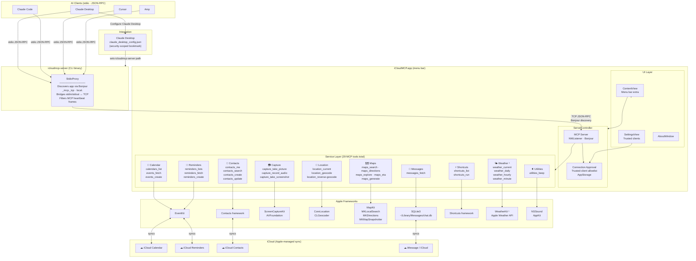
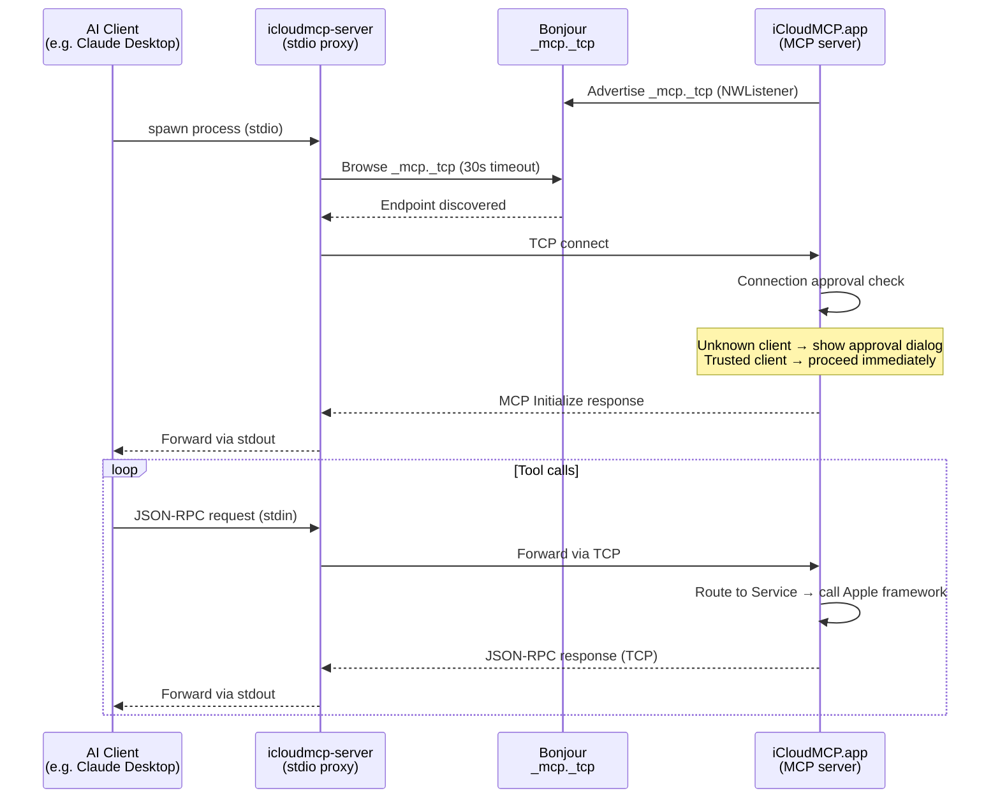

# Architecture Overview — iCloudMCP

iCloudMCP exposes macOS personal data to AI clients via the Model Context Protocol.
It consists of two binaries that communicate over a local Bonjour-advertised TCP connection.

---

## System Architecture

> ¹ WeatherKit is conditionally compiled (`#if WEATHERKIT_AVAILABLE`) and requires the
> `com.apple.developer.weatherkit` entitlement. It is omitted from builds without it.

---

## Transport Detail

---

## Permission Model

Each service gate-checks the relevant macOS permission before any tool call.
Permissions are requested via the standard macOS system dialog on first activation.

| Service | Framework | Permission |
|---|---|---|
| Calendar | EventKit | Full Calendar access |
| Reminders | EventKit | Full Reminders access |
| Contacts | CNContactStore | Contacts access |
| Capture | ScreenCaptureKit / AVFoundation | Screen recording + Camera + Microphone |
| Location | CoreLocation | When-in-use location |
| Maps | MapKit | None (uses location implicitly) |
| Messages | SQLite direct | Sandbox exception + NSOpenPanel bookmark |
| Shortcuts | Shortcuts framework | None |
| Weather | WeatherKit | `weatherkit` entitlement |
| Utilities | AppKit | None |

---

## Key Invariants

- The CLI binary is **not** an MCP server — it is a pure stdio↔TCP bridge. All server logic lives in the app.
- **Only the app process** holds macOS permissions. The CLI has no entitlements of its own.
- All communication is **local-only** (`acceptLocalOnly = true`, IPv4, no peer-to-peer).
- Tool results are encoded as **JSON-LD** via the `Ontology` package (schema.org types).
- The Bonjour service name defaults to the device hostname — see `architecture/SERVER.md` and BUG-0001.
